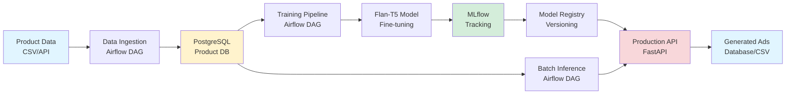
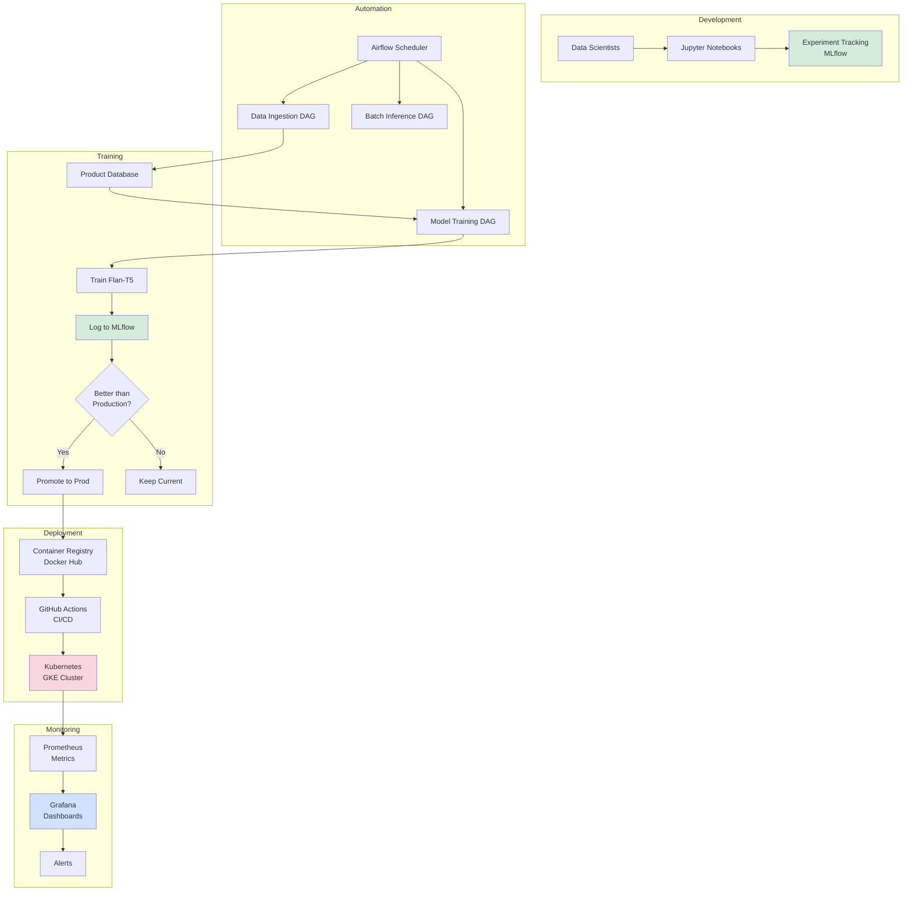
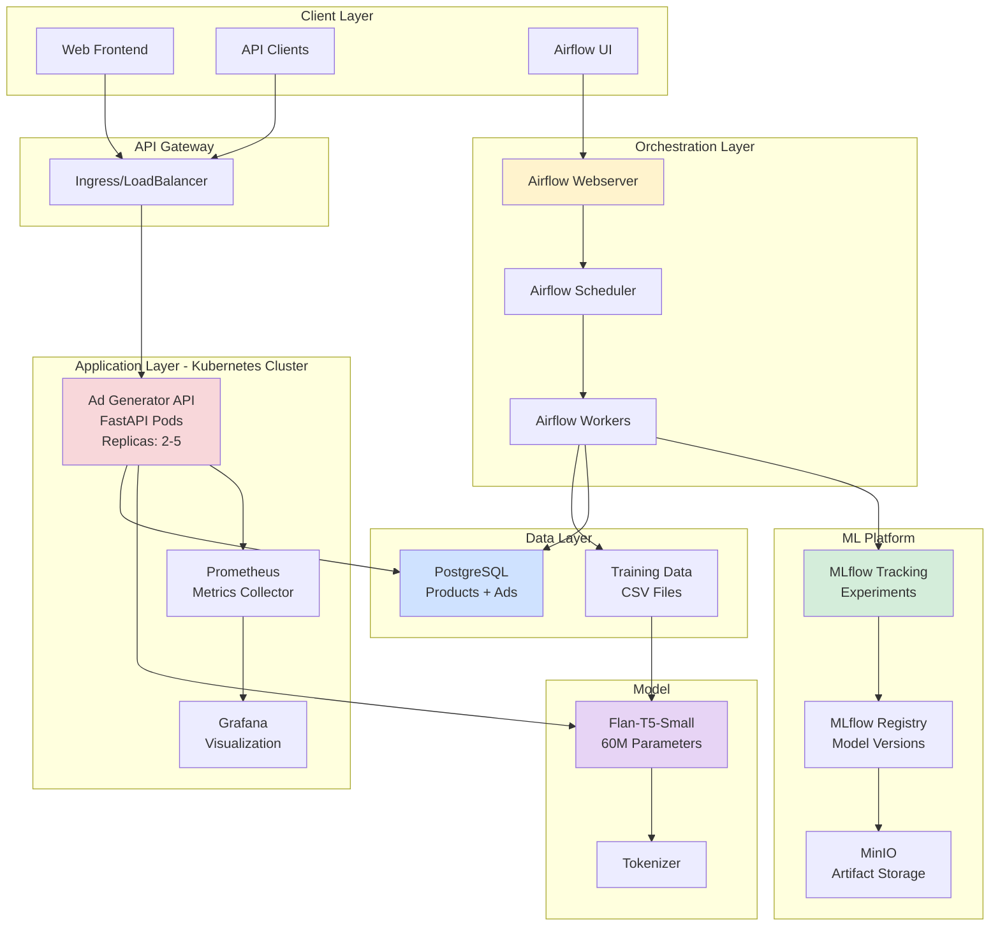
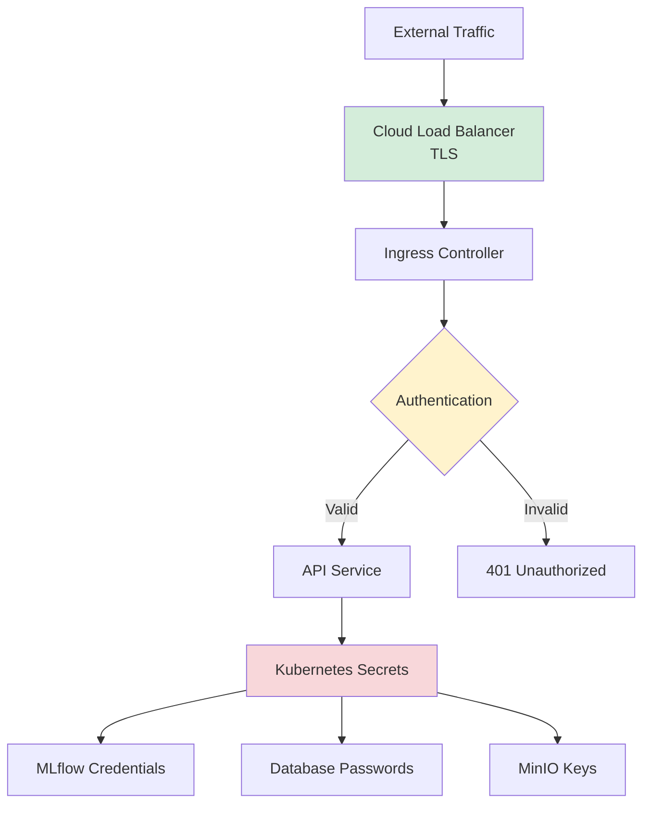
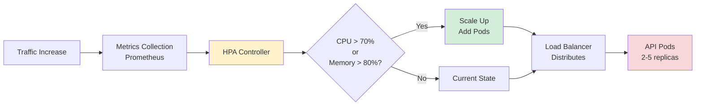
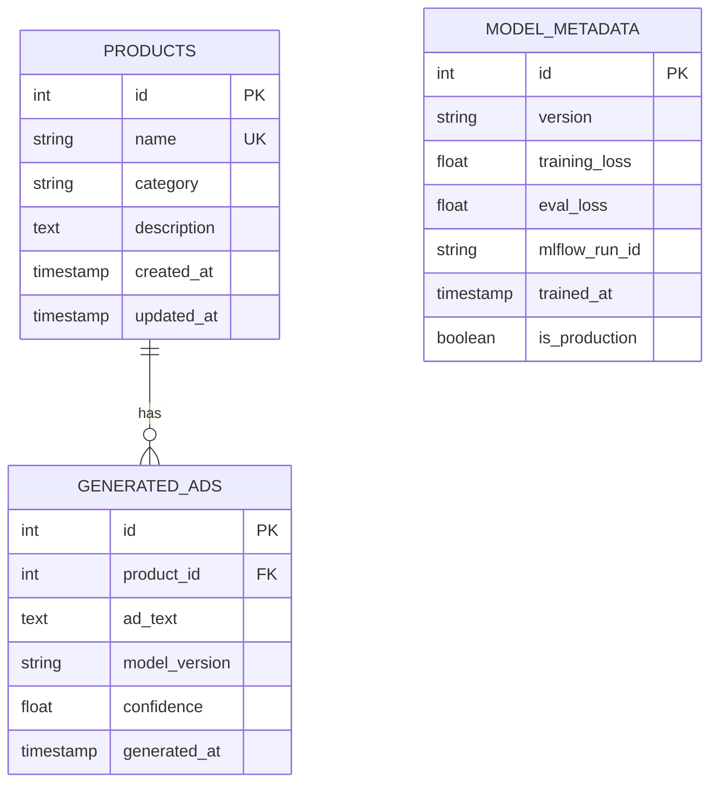
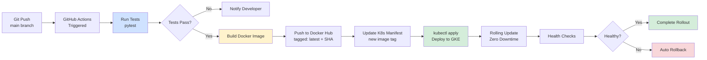
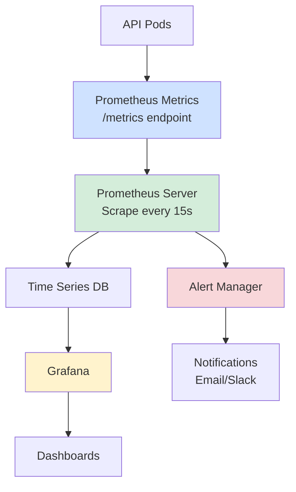

# 🏗️ System Architecture

This document describes the technical architecture of the E-Commerce Ad Creative Generator MLOps system.

---

## 📊 System Overview

The system is built around three core pillars:

1. **ML Pipeline**: Fine-tuned language model for ad generation
2. **MLOps Automation**: Airflow orchestration with MLflow tracking
3. **Production Infrastructure**: Kubernetes deployment with monitoring

---

## 🔄 Data Flow Architecture



**Flow Description**:
1. **Ingestion**: Product data → PostgreSQL (daily)
2. **Training**: Data → Model training → MLflow → Registry (weekly)
3. **Inference**: Products → API → Generated ads (real-time/batch)

---

## 🤖 MLOps Pipeline Architecture



**Pipeline Stages**:
1. **Development**: Experiment → Track → Compare
2. **Automation**: Scheduled DAGs trigger workflows
3. **Training**: Auto-retrain → Compare → Promote
4. **Deployment**: Build → Test → Deploy to K8s
5. **Monitoring**: Collect metrics → Visualize → Alert

---

## 🏛️ System Component Architecture



**Component Descriptions**:

### Client Layer
- **Web Frontend**: React/HTML interface for ad generation
- **API Clients**: External services consuming API
- **Airflow UI**: DAG monitoring and triggering

### API Gateway
- **Ingress/LoadBalancer**: Routes traffic to API pods
- **TLS Termination**: HTTPS support
- **Rate Limiting**: Prevent abuse

### Application Layer (Kubernetes)
- **Ad Generator API**: FastAPI service (2-5 replicas)
  - Health checks: /health, /ready
  - Metrics export: /metrics
  - Auto-scaling via HPA
- **Prometheus**: Scrapes metrics every 15s
- **Grafana**: Real-time dashboards

### Orchestration Layer (Airflow)
- **Webserver**: UI for DAG management
- **Scheduler**: Triggers DAGs on schedule
- **Workers**: Execute tasks (data ingestion, training)

### ML Platform
- **MLflow Tracking**: Log experiments, metrics, params
- **MLflow Registry**: Version control for models
- **MinIO**: S3-compatible artifact storage

### Data Layer
- **PostgreSQL**: Relational database
  - Tables: products, generated_ads, model_metadata
- **Training Data**: CSV files with product→ad examples

### Model
- **Flan-T5-Small**: 60M parameter transformer
- **Tokenizer**: Text preprocessing

---

## 🔐 Security Architecture



**Security Measures**:
- ✅ TLS/HTTPS for all external traffic
- ✅ Kubernetes secrets for sensitive data (base64 encoded)
- ✅ Network policies to isolate services
- ✅ No credentials in code or Docker images
- ✅ Rate limiting on API endpoints
- ✅ CORS configured for web frontend

---

## 📈 Scaling Architecture



**Scaling Configuration**:
- **Min Replicas**: 2 (high availability)
- **Max Replicas**: 5 (cost control)
- **Scale Up Trigger**: CPU > 70% OR Memory > 80%
- **Scale Down**: After 5 min below threshold
- **Target**: 60% CPU utilization

---

## 💾 Data Architecture

### Database Schema



### Data Flow

1. **Ingestion**: CSV → Validation → PostgreSQL
2. **Training**: PostgreSQL → pandas DataFrame → Model
3. **Inference**: Product data → Model → Generated ad → PostgreSQL
4. **Export**: PostgreSQL → CSV/JSON for analysis

---

## 🔄 CI/CD Architecture



**CI/CD Stages**:
1. **Test**: Lint (flake8) + Unit tests (pytest)
2. **Build**: Docker image with  Python 3.9
3. **Push**: Docker Hub with version tags
4. **Deploy**: Kubernetes rolling update
5. **Verify**: Health checks + rollback if failed

---

## 📊 Monitoring Architecture

### Metrics Collection



### Custom Metrics Exported

| Metric | Type | Description |
|--------|------|-------------|
| `ad_generation_requests_total` | Counter | Total API requests |
| `ad_generation_latency` | Histogram | Request latency (ms) |
| `ad_quality_score` | Gauge | Quality score (0-1) |
| `model_version_info` | Gauge | Current model version |
| `http_requests_total` | Counter | HTTP requests by status |

### Alert Rules

- **High Latency**: p99 > 2000ms for 5 min
- **Low Quality**: avg quality < 0.5 for 10 min
- **Service Down**: no requests for 2 min
- **High Errors**: 5xx rate > 5% for 5 min

---

## 🎯 Deployment Topology

### Local Development
```
Docker Desktop
├── MLflow (port 5000)
├── PostgreSQL (port 5432)
├── MinIO (port 9000)
├── Prometheus (port 9090)
└── Grafana (port 3000)

Local Python
└── API (port 8000)
```

### Production (GKE)
```
Google Kubernetes Engine
├── Namespace: ad-generator
│   ├── Deployment: ad-generator-api (2-5 pods)
│   ├── Service: LoadBalancer (external IP)
│   ├── HPA: autoscaling enabled
│   ├── ConfigMap: app-config
│   └── Secret: api-credentials
│
├── Namespace: monitoring
│   ├── Prometheus (scraping)
│   └── Grafana (dashboards)
│
└── Namespace: airflow
    ├── Airflow Webserver
    ├── Airflow Scheduler
    └── Airflow Workers
```

---

## 🚀 Technology Stack

### Core Technologies
- **Language**: Python 3.9+
- **ML Framework**: Hugging Face Transformers
- **Model**: Flan-T5-Small (60M params)
- **API Framework**: FastAPI
- **Database**: PostgreSQL

### MLOps Tools
- **Experiment Tracking**: MLflow
- **Orchestration**: Apache Airflow
- **Monitoring**: Prometheus + Grafana
- **Object Storage**: MinIO (S3-compatible)

### Infrastructure
- **Containerization**: Docker
- **Orchestration**: Kubernetes (GKE)
- **CI/CD**: GitHub Actions
- **Cloud Provider**: Google Cloud Platform

### Development
- **Version Control**: Git + GitHub
- **Testing**: pytest
- **Linting**: flake8, black
- **Documentation**: Markdown, Mermaid

---

## 📦 Container Architecture

### API Container (Dockerfile)
```dockerfile
FROM python:3.9-slim
WORKDIR /app
COPY requirements.txt .
RUN pip install --no-cache-dir -r requirements.txt
COPY src/ ./src/
COPY models/ ./models/
EXPOSE 8000
CMD ["uvicorn", "src.api.main:app", "--host", "0.0.0.0"]
```

**Image Size**: ~1.2GB  
**Layers**: Python base + dependencies + code  
**Health Check**: GET /health every 30s

---

## 🔧 Configuration Management

### Environment Variables
- `.env`: Local development config
- `k8s/configmap.yaml`: Non-sensitive K8s config
- `k8s/secret.yaml`: Sensitive credentials (base64)

### Feature Flags
- Model version selection
- Batch size configuration
- Quality threshold tuning

---

## 📝 API Architecture

### REST Endpoints

```
POST /generate
  - Generate single ad
  - Input: {product_name, category, description}
  - Output: {ad_text, quality_score, model_version}

GET /health
  - Health check
  - Returns: {status: "healthy"}

GET /metrics
  - Prometheus metrics
  - Format: OpenMetrics

GET /docs
  - FastAPI documentation
  - Interactive Swagger UI
```

### Request Flow
1. Client → LoadBalancer
2. LoadBalancer → API Pod (round-robin)
3. API → Load model from cache
4. Model → Generate ad with beam search
5. API → Calculate quality score
6. API → Log metrics to Prometheus
7. Response → Client

---

## 🎓 Design Decisions

### Why Flan-T5-Small?
- ✅ Instruction-tuned (understands "generate ad")
- ✅ Small enough for CPU inference (~1s latency)
- ✅ Good quality with 1000 examples
- ✅ Fits in 2GB RAM

### Why FastAPI?
- ✅ Fast async I/O
- ✅ Auto-generated OpenAPI docs
- ✅ Type safety with Pydantic
- ✅ Built-in metrics support

### Why Kubernetes?
- ✅ Auto-scaling based on load
- ✅ Self-healing (pod restarts)
- ✅ Zero-downtime rolling updates
- ✅ Industry standard for ML deployment

### Why Airflow?
- ✅ Complex DAG dependencies
- ✅ Retry logic built-in
- ✅ Rich UI for monitoring
- ✅ Cron-like scheduling

---

## 🔮 Future Enhancements

1. **A/B Testing**: Canary deployments with traffic splitting
2. **Model Drift Detection**: Statistical tests on input distribution
3. **Multi-language Support**: Generate ads in Spanish, French
4. **Image Generation**: Add product images to ads
5. **Feedback Loop**: User ratings → retrain on best ads

---

**For operations guide, see [RUNBOOK.md](RUNBOOK.md)**
